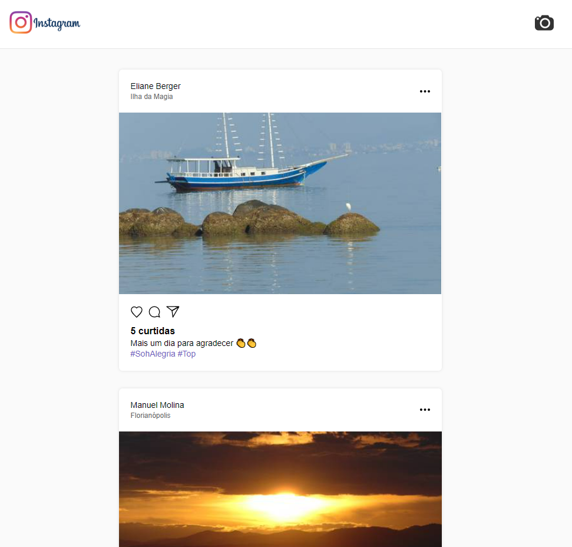
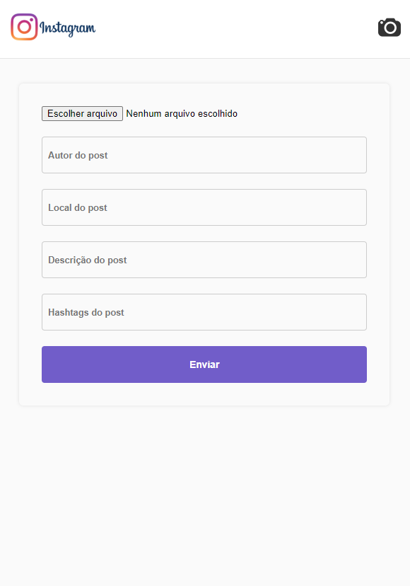

<h1 align="center">
   Semana OmniStack 7.0 - Projeto Clone Instagram 
</h1>

<p align="center">
  <a href="#-projeto">Projeto</a>&nbsp;&nbsp;&nbsp;|&nbsp;&nbsp;&nbsp;
  <a href="#-tecnologias">Tecnologias</a>&nbsp;&nbsp;&nbsp;|&nbsp;&nbsp;&nbsp;
  <a href="#-funcionalidades-disponiveis">Funcionalidades Disponiveis</a>&nbsp;&nbsp;&nbsp;|&nbsp;&nbsp;&nbsp;
  <a href="#-como-instalar-o-projeto">Como instalar o projeto?</a>&nbsp;&nbsp;&nbsp;&nbsp;&nbsp;&nbsp;
</p>

## 💻 Projeto

Esse projeto demonstra uma aplicação que funciona em 'tempo real', ou seja, é possível criar e curtir posts em diferentes pontos de acesso. Oferecendo um feed que possibilita algumas interações entre usuários.

## 🔖 Layout

<h1 align="center">
    
    
    
</h1>

<br/>
<br/>

## 🚀 Tecnologias

- [ReactJS](https://reactjs.org)
- [NodeJS](https://nodejs.org/en/)
- [MongoDB Atlas](https://www.mongodb.com/atlas/database)

### 📡 Ferramentas Complementares

- [Eslint](https://eslint.org/)
- [Axios](https://axios-http.com/)
- [Socket.IO](https://socket.io/)

<br/>

## ⚙ Funcionalidades Disponiveis

### Front-End

> Deve ser possível criar um post através da câmera no canto superior da tela.

> Deve ser possível curtir um post apresentado no feed.

### Back-End

> Deve ser possível listar todos os posts

> Deve ser possível criar um novo post

> Deve ser possível curtir um post

## 🤔 Como instalar o projeto?

- Faça um clone desse repositório;
- Acesse um arquivo local desejado através do terminal e digite:

```sh
git clone https://github.com/ManuelMolina02/semana-omnistack-7.0.git
```

Após baixar o projeto, acesse os repositórios via terminal e execute os seguintes comandos:

Para instalar e inicializar o front-end:

```sh
cd app

yarn install
yarn start
```

Para instalar e inicializar o back-end:

```sh
cd server

yarn install
yarn start
```

<br/>
<br/>

> Esse é apenas um projeto de estudos que oferece somente o código como referência, as variáveis que conectam ao banco de dados não estão disponíveis.

<br/>
<br/>
Feito com 💜 por Manuel Molina 👋 Me contate através do [LinkedIn!](https://www.linkedin.com/in/manuel-angel-berger-molina-ba08b3174/)
